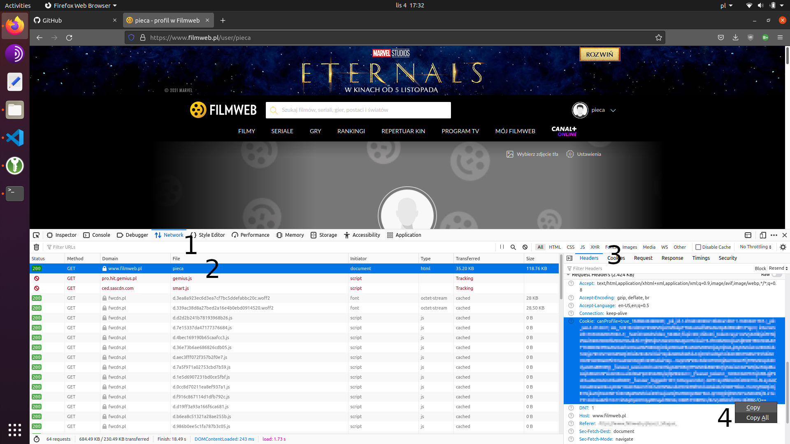

# filmweb-export

Export ocen z serwisu [Filmweb](https://www.filmweb.pl).

## Instalacja

Wymagania:

- [Python](https://www.python.org/).

Instalacja:

```
pip install filmweb
```

Albo:

```
pip install https://github.com/ppatrzyk/filmweb-export/archive/master.zip
```

## Instrukcja

Istnieje możliwość eksportu własnych ocen lub ocen znajomych - proszę podać nazwę użytkownika jako `username`. Do dostępu jest potrzebne zalogowanie się na portal i podanie do skryptu wartości `cookie` dla strony filmweb. Podstawowe użycie:

```
filmweb <username> <cookie>
```

### Skąd wziąć cookie?

1. Otwórz *Network Monitor* w przeglądarce (`Ctrl+Shift+E` w Firefoxie),
2. Zaloguj się i wejdź na filmweb. Znajdź i wejdź w szczegóły obecnej strony,
3. Wejdź w zakładkę *Headers* > *Request Headers*,
4. Skopiuj wartość *Cookie* i podaj ją jako argument do skryptu.



### Przykład

```
$ filmweb -f csv -f json pieca "didomi_token=(...)=="
INFO:root:Checking args...
INFO:root:Fetching list of movies [1/6]...
100%|██████████████████████████████████████████████████████████████████████████████████████████████████████████████████████| 38/38 [00:07<00:00,  4.98it/s]
INFO:root:Parsing list of movies [2/6]...
100%|██████████████████████████████████████████████████████████████████████████████████████████████████████████████████████| 38/38 [00:02<00:00, 15.47it/s]
INFO:root:User pieca has 938 movies...
INFO:root:Fetching user ratings [3/6]...
100%|████████████████████████████████████████████████████████████████████████████████████████████████████████████████████| 938/938 [00:34<00:00, 27.34it/s]
INFO:root:Fetching info about movies [4/6]...
100%|████████████████████████████████████████████████████████████████████████████████████████████████████████████████████| 938/938 [00:33<00:00, 27.63it/s]
INFO:root:Fetching global rating for movies [5/6]...
100%|████████████████████████████████████████████████████████████████████████████████████████████████████████████████████| 938/938 [00:35<00:00, 26.57it/s]
INFO:root:Writing data [6/6]...
INFO:root:pieca_20230523.json written!
INFO:root:pieca_20230523.csv written!
$ cat pieca_20230523.json | jq .[0]
{
  "timestamp": 1579354599456,
  "favorite": null,
  "user_rating": 5,
  "global_rating": 6.03865,
  "global_rating_count": 414,
  "original_title": "Ejdeha Vared Mishavad!",
  "pl_title": "Wejście smoka!",
  "year": 2016,
  "movie_id": "757318",
  "url": "https://www.filmweb.pl/film/Wej%C5%9Bcie+smoka%21-2016-757318",
  "date": "2020-01-18"
}
$ cat pieca_20230523.csv | xsv sample 3 | xsv table
timestamp      favorite  user_rating  global_rating  global_rating_count  original_title          pl_title                 year  movie_id  url                                                                  date
1588407481213            9            7.91448        3777                 Werckmeister harmóniák  Harmonie Werckmeistera   2000  117108    https://www.filmweb.pl/film/Harmonie+Werckmeistera-2000-117108       2020-05-02
1425511804375            4            6.69102        87448                Czas surferów           Czas surferów            2005  137466    https://www.filmweb.pl/film/Czas+surfer%C3%B3w-2005-137466           2015-03-05
1496177689168            6            7.16478        619                  Kukačka v temném lese   Kukułka w ciemnym lesie  1984  35947     https://www.filmweb.pl/film/Kuku%C5%82ka+w+ciemnym+lesie-1984-35947  2017-05-30             2015-03-05
```

### Wszystkie opcje

```
$ filmweb -h
filmweb

Usage:
    filmweb [--format=<fileformat>]... [--debug] <username> <cookie>

Options:
    -h --help                     Show this screen
    -f --format=<fileformat>      Output file format: json (default), csv, letterboxd
    -d --debug                    Debug prints
```

## Dostępne dane:

Kolumna | Opis
--- | ---
year | _premiera_
global\_rating\_count | _ilość ocen filmu_
global\_rating | _ocena filmweb_
timestamp | _[czas oceny (unix)](https://pl.wikipedia.org/wiki/Czas_uniksowy)_
date | _data oceny_ (yyyy-mm-dd)
user\_rating | _ocena użytkownika_
favorite | _dodany do ulubionych_
original\_title | _tytuł oryginalny_
pl\_title | _tytuł polski_
movie\_id | _id filmu_ (filmweb)
url | _strona filmu_

## Znane problemy:

- Eksport tylko ocen filmów, inne (np. seriale) niedostępne,
